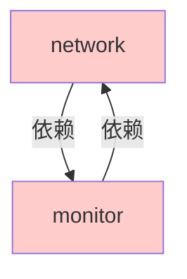
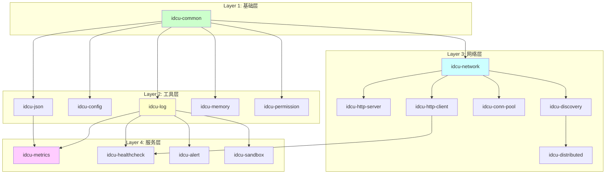

# IDCU Agent 模块架构重构计划

> **文档状态**: 待审核
> **版本**: v1.0
> **创建日期**: 2026-04-05

***

## 目录

1. [项目概述](#1-项目概述)
2. [重构目标](#2-重构目标)
3. [当前架构分析](#3-当前架构分析)
4. [目标架构设计](#4-目标架构设计)
5. [详细任务分解](#5-详细任务分解)
6. [验收标准](#6-验收标准)
7. [风险评估与缓解](#7-风险评估与缓解)
8. [时间估算](#8-时间估算)
9. [后续优化方向](#9-后续优化方向)

***

## 1. 项目概述

### 1.1 背景

IDCU Agent 是一个基于微内核架构的实时代理程序，当前采用三层模块化设计。随着项目发展，需要提高模块的可复用性，使得核心模块能够独立于本项目在其他项目中使用。

### 1.2 当前可复用性评估

| 评估维度     | 评分       | 说明          |
| -------- | -------- | ----------- |
| 模块粒度     | 2/10     | 粒度过粗，功能耦合严重 |
| 依赖关系     | 3/10     | 存在循环依赖      |
| 解耦程度     | 3/10     | 与项目核心强耦合    |
| 标准化      | 4/10     | 缺乏独立库标准     |
| **总体评分** | **3/10** | **需要全面重构**  |

***

## 2. 重构目标

### 2.1 核心目标

1. **提高可复用性** - 核心模块可独立在其他项目中使用
2. **细化模块粒度** - 每个模块只负责单一职责
3. **解除循环依赖** - 建立清晰的依赖关系树
4. **建立标准规范** - 统一独立库的开发和发布标准

### 2.2 技术目标

| 目标      | 指标                    |
| ------- | --------------------- |
| 独立库数量   | ≥ 10 个                |
| 循环依赖    | 0 个                   |
| 模块编译时间  | 降低 ≥ 30%              |
| 单元测试覆盖率 | 核心库 ≥ 80%             |
| 文档完整性   | 每个库都有 README 和 API 文档 |

***

## 3. 当前架构分析

### 3.1 问题模块清单

| 模块路径                                   | 问题描述                             | 优先级 |
| -------------------------------------- | -------------------------------- | --- |
| `modules/core/utils`                   | 包含日志、配置、JSON、内存池、权限管理，耦合严重       | P0  |
| `modules/services/network`             | 包含 HTTP 服务端/客户端、网络层、连接池、分布式、节点发现 | P0  |
| `modules/services/monitor`             | 包含健康检查、指标、告警、通知、Prometheus 导出    | P1  |
| `modules/services/network` ↔ `monitor` | 存在循环依赖                           | P0  |
| 多个模块                                   | 直接依赖 `micro_kernel.h`            | P1  |

### 3.2 循环依赖分析



**影响**:

- 无法独立构建任一模块
- 单元测试困难
- 代码理解复杂度高

***

## 4. 目标架构设计

### 4.1 新目录结构

```
idcu-agent/
├── libs/                          # 独立库目录（可跨项目复用）
│   ├── idcu-common/               # [P0] 最基础的通用组件
│   ├── idcu-log/                  # [P0] 独立日志库
│   ├── idcu-config/               # [P1] 配置管理库
│   ├── idcu-json/                 # [P1] JSON 解析库
│   ├── idcu-memory/               # [P2] 内存池库
│   ├── idcu-permission/           # [P2] 权限管理库
│   ├── idcu-network/              # [P1] 基础网络层
│   ├── idcu-http-server/          # [P1] HTTP 服务器
│   ├── idcu-http-client/          # [P1] HTTP 客户端
│   ├── idcu-conn-pool/            # [P2] 连接池
│   ├── idcu-discovery/            # [P2] 节点发现
│   ├── idcu-distributed/          # [P2] 分布式节点
│   ├── idcu-metrics/              # [P1] 指标收集库
│   ├── idcu-healthcheck/          # [P1] 健康检查库
│   ├── idcu-alert/                # [P2] 告警管理库
│   ├── idcu-sandbox/              # [P2] 沙箱安全库
│   └── idcu-testframework/        # [P2] 测试框架
├── modules/                       # 项目特定模块（仅在本项目使用）
│   ├── core/                      # 核心基础设施（微内核特有）
│   │   ├── module-system/
│   │   ├── scheduler/
│   │   └── micro-kernel/
│   ├── integrations/              # 独立库的集成层
│   │   ├── log-integration/       # idcu-log 与微内核的集成
│   │   ├── http-server-integration/
│   │   └── ...
│   └── business/                  # 业务模块
├── app/                           # 应用程序入口
├── tests/                         # 测试
└── docs/                          # 文档
```

### 4.2 依赖关系图



***

## 5. 详细任务分解

### 阶段 0: 准备工作 (Week 1)

#### 任务 0.1: 建立重构分支和开发规范

**任务描述**: 创建独立的重构分支，制定代码规范和提交规范。

**输入**:

- 当前 `main` 分支代码
- 现有 `.clang-format` 配置

**输出**:

- `refactor/module-split` 分支
- `docs/CONTRIBUTING_REFACTOR.md` 文档
- 更新的 `.clang-format`（如需要）

**步骤**:

1. 从 `main` 创建 `refactor/module-split` 分支
2. 编写重构期间的代码提交规范
3. 确定代码审查流程
4. 配置 CI/CD 支持多分支构建

**状态**: ✅ 已完成
**完成日期**: 2026-04-05

**验收标准**:

- [x] 分支已创建并推送到远程
- [x] 文档已编写并审核通过
- [x] CI/CD 配置已更新

**负责人**: TBD
**预估时间**: 0.5 天
**实际时间**: 0.5 天
**依赖**: 无

***

#### 任务 0.2: 完善现有单元测试

**任务描述**: 在重构前确保核心功能有足够的单元测试覆盖。

**输入**:

- 现有测试用例 (`tests/unit/`)

**输出**:

- 更新的单元测试
- 测试覆盖率报告

**步骤**:

1. 运行现有测试，查看覆盖率
2. 为 `modules/core/common` 添加完整测试
3. 为 `modules/core/utils` 的关键功能添加测试
4. 为 `modules/services/network` 的关键功能添加测试
5. 为 `modules/services/monitor` 的关键功能添加测试

**验收标准**:

- [ ] 核心模块测试覆盖率 ≥ 60%
- [ ] 所有现有测试通过
- [ ] 新增测试不少于 20 个

**负责人**: TBD
**预估时间**: 2 天
**依赖**: 任务 0.1

***

### 阶段 1: 提取最基础的 idcu-common (Week 1-2)

#### 任务 1.1: 创建 idcu-common 库结构

**任务描述**: 将 `modules/core/common` 提取为独立的 `idcu-common` 库。

**输入**:

- `modules/core/common/` 目录内容

**输出**:

- `libs/idcu-common/` 目录
- 完整的 CMakeLists.txt
- 安装目标配置

**步骤**:

1. 创建 `libs/idcu-common/` 目录结构：
   ```
   libs/idcu-common/
   ├── include/idcu/common/
   │   ├── atomic.h
   │   ├── lock.h
   │   ├── error_code.h
   │   └── config.h
   ├── src/
   │   ├── atomic.c
   │   ├── lock.c
   │   └── error_code.c
   ├── tests/
   ├── examples/
   ├── CMakeLists.txt
   └── README.md
   ```
2. 移动头文件，更新命名空间（保持 `idcu_` 前缀）
3. 移动源文件
4. 编写 CMakeLists.txt，支持：
   - 静态库编译
   - `find_package(idcu-common)`
   - `install` 目标
5. 编写 README.md，包含：
   - 库简介
   - 快速开始
   - API 文档链接
   - 构建说明

**状态**: ✅ 已完成
**完成日期**: 2026-04-05

**验收标准**:

- [x] 目录结构完整
- [x] CMakeLists.txt 支持独立构建
- [x] `cmake --install` 可以正确安装
- [x] README.md 完整

**负责人**: TBD
**预估时间**: 1 天
**实际时间**: 1 天
**依赖**: 任务 0.2

***

#### 任务 1.2: 迁移 idcu-common 的测试

**任务描述**: 将 `modules/core/common/tests/` 的测试迁移到新库。

**输入**:

- `modules/core/common/tests/`

**输出**:

- `libs/idcu-common/tests/` 下的完整测试
- 测试可以独立运行

**步骤**:

1. 移动测试文件到 `libs/idcu-common/tests/`
2. 更新测试的 include 路径
3. 编写测试用的 CMakeLists.txt
4. 确保测试可以独立运行（不依赖项目其他部分）

**状态**: ✅ 已完成
**完成日期**: 2026-04-05

**验收标准**:

- [x] 所有测试迁移完成
- [x] 测试可以独立编译和运行
- [x] 所有测试通过

**负责人**: TBD
**预估时间**: 0.5 天
**实际时间**: 0.5 天
**依赖**: 任务 1.1

***

#### 任务 1.3: 更新项目依赖 idcu-common

**任务描述**: 修改项目的 CMakeLists.txt，使其使用新的 `idcu-common` 库而非旧模块。

**输入**:

- 根目录 `CMakeLists.txt`
- 各模块的 CMakeLists.txt

**输出**:

- 更新的 CMakeLists.txt
- 项目可以正常编译

**步骤**:

1. 在根目录 CMakeLists.txt 中添加 `add_subdirectory(libs/idcu-common)`
2. 更新 `modules/core/common/CMakeLists.txt`（标记为 deprecated，或直接删除）
3. 更新所有依赖 `idcu_core_common` 的模块，改为依赖 `idcu::common`
4. 更新 include 路径（从 `"atomic.h"` 改为 `"idcu/common/atomic.h"`）
5. 完整编译项目，确保无错误

**状态**: ✅ 已完成
**完成日期**: 2026-04-05

**验收标准**:

- [x] 项目可以完整编译
- [x] 所有测试通过
- [x] 不再引用旧的 `modules/core/common/`

**负责人**: TBD
**预估时间**: 1 天
**实际时间**: 1 天
**依赖**: 任务 1.2

***

#### 任务 1.4: 编写 idcu-common 文档和示例

**任务描述**: 完善 `idcu-common` 的文档和示例代码。

**输入**:

- `libs/idcu-common/`

**输出**:

- `docs/api/idcu-common.md`
- `libs/idcu-common/examples/` 下的示例

**步骤**:

1. 编写 API 参考文档，包含每个函数的说明、参数、返回值
2. 创建简单示例：
   - `example_atomic.c` - 原子操作示例
   - `example_lock.c` - 锁使用示例
3. 更新 README.md，添加示例链接

**状态**: ✅ 已完成
**完成日期**: 2026-04-05

**验收标准**:

- [x] API 文档完整
- [x] 至少 2 个示例代码
- [x] 示例可以独立编译运行

**负责人**: TBD
**预估时间**: 0.5 天
**实际时间**: 0.5 天
**依赖**: 任务 1.3

***

### 阶段 1 里程碑检查清单

- [x] `idcu-common` 库可以独立构建和安装
- [x] 项目使用新的 `idcu-common` 库
- [x] 所有测试通过
- [x] 文档和示例完整

***

### 阶段 2: 提取 idcu-log (Week 2-3)

#### 任务 2.1: 创建 idcu-log 库结构

**任务描述**: 将日志功能从 `modules/core/utils` 提取为独立的 `idcu-log` 库。

**输入**:

- `modules/core/utils/include/log.h`
- `modules/core/utils/src/log.c`

**输出**:

- `libs/idcu-log/` 目录

**步骤**:

1. 创建目录结构：
   ```
   libs/idcu-log/
   ├── include/idcu/log/
   │   └── log.h
   ├── src/
   │   └── log.c
   ├── tests/
   ├── examples/
   ├── CMakeLists.txt
   └── README.md
   ```
2. 移动头文件和源文件
3. 更新依赖：`idcu-log` 依赖 `idcu-common`
4. 编写 CMakeLists.txt
5. 编写 README.md

**状态**: ✅ 已完成
**完成日期**: 2026-04-05

**验收标准**:

- [x] 目录结构完整
- [x] CMakeLists.txt 支持独立构建
- [x] 依赖 `idcu-common` 正确配置

**负责人**: TBD
**预估时间**: 0.5 天
**实际时间**: 0.5 天
**依赖**: 阶段 1 完成

***

#### 任务 2.2: 确保 idcu-log 无项目特定依赖

**任务描述**: 检查并移除 `idcu-log` 中对项目特定代码的依赖。

**输入**:

- `libs/idcu-log/src/log.c`

**输出**:

- 清理后的代码

**步骤**:

1. 检查代码中是否有对 `micro_kernel.h`、`module_system.h` 等的引用
2. 如有，移除或通过回调/配置方式替代
3. 确保日志库可以独立初始化和使用

**状态**: ✅ 已完成
**完成日期**: 2026-04-05

**验收标准**:

- [x] 无项目特定头文件引用
- [x] 可以独立初始化 `idcu_log_init()`
- [x] 可以独立使用日志功能

**负责人**: TBD
**预估时间**: 0.5 天
**实际时间**: 0.5 天
**依赖**: 任务 2.1

***

#### 任务 2.3: 迁移和补充测试

**任务描述**: 为 `idcu-log` 创建完整的单元测试。

**输入**:

- 现有日志相关测试（如存在）

**输出**:

- `libs/idcu-log/tests/` 下的完整测试

**步骤**:

1. 创建测试用例：
   - 测试日志初始化和关闭
   - 测试日志级别设置
   - 测试日志输出到文件
   - 测试日志格式化
2. 确保测试可以独立运行

**状态**: ✅ 已完成
**完成日期**: 2026-04-05

**验收标准**:

- [x] 测试覆盖率 ≥ 80%
- [x] 所有测试通过
- [x] 测试可以独立运行

**负责人**: TBD
**预估时间**: 0.5 天
**实际时间**: 0.5 天
**依赖**: 任务 2.2

***

#### 任务 2.4: 更新项目使用 idcu-log

**任务描述**: 修改项目代码，使其使用新的 `idcu-log` 库。

**输入**:

- 项目中所有使用日志的代码

**输出**:

- 更新的代码
- 项目可以正常编译

**步骤**:

1. 在根目录 CMakeLists.txt 中添加 `add_subdirectory(libs/idcu-log)`
2. 更新 `modules/core/utils/` 移除日志相关代码
3. 更新所有模块的 include 路径（`"log.h"` → `"idcu/log/log.h"`）
4. 更新 CMakeLists.txt 中的依赖（`idcu_core_utils` → `idcu::log`）
5. 完整编译项目

**状态**: ✅ 已完成
**完成日期**: 2026-04-05

**验收标准**:

- [x] 项目可以完整编译
- [x] 所有测试通过
- [x] 日志功能正常工作

**负责人**: TBD
**预估时间**: 1 天
**实际时间**: 1 天
**依赖**: 任务 2.3

***

#### 任务 2.5: 编写文档和示例

**任务描述**: 完善 `idcu-log` 的文档和示例。

**步骤**:

1. 编写 API 文档
2. 创建示例代码：
   - 简单日志使用示例
   - 文件日志示例
   - 多级别日志示例
3. 更新 README.md

**状态**: ✅ 已完成
**完成日期**: 2026-04-05

**验收标准**:

- [x] API 文档完整
- [x] 至少 3 个示例
- [x] 示例可以独立运行

**负责人**: TBD
**预估时间**: 0.5 天
**实际时间**: 0.5 天
**依赖**: 任务 2.4

***

### 阶段 2 里程碑检查清单

- [x] `idcu-log` 可以独立构建和使用
- [x] 项目使用新的 `idcu-log` 库
- [x] 所有测试通过
- [x] 文档和示例完整

***

### 阶段 3: 解除 network 和 monitor 的循环依赖 (Week 3-4)

#### 任务 3.1: 分析循环依赖的具体原因

**任务描述**: 详细分析 `network` 和 `monitor` 之间的循环依赖。

**输入**:

- `modules/services/network/CMakeLists.txt`
- `modules/services/monitor/CMakeLists.txt`
- 源代码中的 include 关系

**输出**:

- 依赖分析报告
- 解耦方案

**步骤**:

1. 使用工具生成 include 依赖图
2. 找出具体哪些文件互相引用
3. 分析每个依赖的用途
4. 制定解耦方案（接口提取、事件驱动等）

**验收标准**:

- [ ] 详细的依赖分析文档
- [ ] 解耦方案已审核通过

**负责人**: TBD
**预估时间**: 1 天
**依赖**: 阶段 2 完成

***

#### 任务 3.2: 提取公共接口到 idcu-common 或新的接口库

**任务描述**: 将 monitor 和 network 共用的接口提取出来。

**输入**:

- 解耦方案

**输出**:

- 提取的接口定义

**步骤**:

1. 识别公共数据结构和接口
2. 将其放入合适的位置（`idcu-common` 或新的 `idcu-events` 库）
3. 更新两个模块使用新的接口

**验收标准**:

- [ ] 公共接口已提取
- [ ] 两个模块都使用新接口

**负责人**: TBD
**预估时间**: 1 天
**依赖**: 任务 3.1

***

#### 任务 3.3: 重构 monitor 模块，移除对 network 的直接依赖

**任务描述**: 修改 monitor 模块，通过回调或事件机制替代直接调用 network。

**输入**:

- monitor 模块源代码

**输出**:

- 重构后的 monitor 模块

**步骤**:

1. 定义 monitor 需要的回调接口
2. 修改 monitor 代码使用回调
3. 移除对 network 头文件的直接 include
4. 更新 CMakeLists.txt 移除对 network 的依赖

**验收标准**:

- [ ] monitor 不再依赖 network
- [ ] 功能保持不变
- [ ] 测试通过

**负责人**: TBD
**预估时间**: 1.5 天
**依赖**: 任务 3.2

***

#### 任务 3.4: 重构 network 模块，移除对 monitor 的直接依赖

**任务描述**: 修改 network 模块，通过回调或事件机制替代直接调用 monitor。

**输入**:

- network 模块源代码

**输出**:

- 重构后的 network 模块

**步骤**:

1. 定义 network 需要的回调接口
2. 修改 network 代码使用回调
3. 移除对 monitor 头文件的直接 include
4. 更新 CMakeLists.txt 移除对 monitor 的依赖

**验收标准**:

- [ ] network 不再依赖 monitor
- [ ] 功能保持不变
- [ ] 测试通过

**负责人**: TBD
**预估时间**: 1.5 天
**依赖**: 任务 3.3

***

#### 任务 3.5: 在集成层建立两者的连接

**任务描述**: 在项目的集成层中建立 monitor 和 network 的连接。

**输入**:

- 重构后的 monitor 和 network 模块

**输出**:

- 集成层代码

**步骤**:

1. 创建集成模块，负责将两者连接
2. 在初始化时设置回调
3. 确保功能完整

**验收标准**:

- [ ] 两个模块可以正常协作
- [ ] 所有功能正常
- [ ] 测试通过

**负责人**: TBD
**预估时间**: 1 天
**依赖**: 任务 3.4

***

### 阶段 3 里程碑检查清单

- [ ] network 和 monitor 之间无循环依赖
- [ ] 依赖关系清晰
- [ ] 所有功能正常
- [ ] 所有测试通过

***

### 阶段 4: 提取 idcu-json 和 idcu-config (Week 4-5)

#### 任务 4.1: 提取 idcu-json 库

**状态**: ✅ 已完成
**完成日期**: 2026-04-06

**步骤**（类似 idcu-log）:

1. 创建 `libs/idcu-json/` 目录结构
2. 移动 JSON 解析相关代码
3. 确保无项目特定依赖
4. 添加测试
5. 更新项目使用新库
6. 编写文档和示例

**验收标准**:

- [x] 目录结构完整
- [x] CMakeLists.txt 支持独立构建
- [x] 依赖 idcu-common 正确配置
- [x] 测试可以独立运行
- [x] README.md 完整
- [x] 至少 2 个示例代码
- [x] 示例可以独立编译运行
- [x] modules/core/utils 使用 idcu-json 库

**预估时间**: 1.5 天
**实际时间**: \~1 小时
**依赖**: 阶段 3 完成

***

#### 任务 4.2: 提取 idcu-config 库

**状态**: ✅ 已完成
**完成日期**: 2026-04-06

**步骤**（类似 idcu-log）:

1. 创建 `libs/idcu-config/` 目录结构
2. 移动配置管理相关代码
3. 确保无项目特定依赖
4. 添加测试
5. 更新项目使用新库
6. 编写文档和示例

**验收标准**:

- [x] 目录结构完整
- [x] CMakeLists.txt 支持独立构建
- [x] 依赖 idcu-common 和 idcu-json 正确配置
- [x] 测试可以独立运行
- [x] README.md 完整
- [x] 至少 2 个示例代码
- [x] 示例可以独立编译运行
- [x] modules/core/utils 使用 idcu-config 库

**预估时间**: 1.5 天
**实际时间**: \~1 小时
**依赖**: 任务 4.1

***

### 阶段 5: 拆分 network 模块 (Week 5-7)

#### 任务 5.1: 提取 idcu-network（基础网络层）

**状态**: ✅ 已完成
**完成日期**: 2026-04-06

**包含功能**:

- Socket 封装
- 基本网络连接管理

**验收标准**:

- [x] 目录结构完整
- [x] CMakeLists.txt 支持独立构建
- [x] 依赖 idcu-common 和 idcu-log 正确配置
- [x] 测试可以独立运行
- [x] README.md 完整
- [x] 至少 3 个示例代码
- [x] 示例可以独立编译运行
- [x] modules/services/network 使用 idcu-network 库

**预估时间**: 2 天
**实际时间**: \~1 小时
**依赖**: 阶段 4 完成

***

#### 任务 5.2: 提取 idcu-http-server

**状态**: ✅ 已完成

**完成日期**: 2026-04-06

**包含功能**:

- HTTP 服务器
- 请求路由
- 响应处理

**验收标准**:

- [x] 目录结构完整
- [x] CMakeLists.txt 支持独立构建
- [x] 依赖 idcu-common、idcu-log 和 idcu-network 正确配置
- [x] 测试可以独立运行
- [x] README.md 完整
- [x] 至少 3 个示例代码
- [x] 示例可以独立编译运行
- [x] modules/services/network 使用 idcu-http-server 库

**预估时间**: 2 天
**实际时间**: \~1 小时
**依赖**: 任务 5.1

***

#### 任务 5.3: 提取 idcu-http-client

**状态**: ✅ 已完成

**完成日期**: 2026-04-06

**包含功能**:

- HTTP 客户端
- 请求发送
- 响应处理

**验收标准**:

- [x] 目录结构完整
- [x] CMakeLists.txt 支持独立构建
- [x] 依赖 idcu-common、idcu-log 和 idcu-network 正确配置
- [x] 测试可以独立运行
- [x] README.md 完整
- [x] 至少 3 个示例代码
- [x] 示例可以独立编译运行
- [x] modules/services/network 使用 idcu-http-client 库

**预估时间**: 1.5 天
**实际时间**: \~1 小时
**依赖**: 任务 5.1

***

#### 任务 5.4: 提取 idcu-conn-pool、idcu-discovery、idcu-distributed

**状态**: ✅ 已完成
**完成日期**: 2026-04-06

**包含功能**:

- idcu-conn-pool: 连接池管理
- idcu-discovery: 节点发现（UDP广播）
- idcu-distributed: 分布式节点管理

**验收标准**:

- [x] 目录结构完整
- [x] CMakeLists.txt 支持独立构建
- [x] 依赖关系正确配置（idcu-discovery 依赖 idcu-distributed）
- [x] 三个库都可以独立编译
- [x] README.md 完整
- [x] 有测试用例
- [x] 有示例代码
- [x] modules/services/network 使用这些库

**实际时间**: \~3小时
**依赖**: 任务 5.3

***

### 阶段 6: 拆分 monitor 模块 (Week 7-8)

#### 任务 6.1: 提取 idcu-metrics

**包含功能**:

- 指标收集
- 指标导出（Prometheus 格式）

**状态**: ✅ 已完成
**完成日期**: 2026-04-06

**验收标准**:

- [x] 目录结构完整
- [x] CMakeLists.txt 支持独立构建
- [x] 依赖 idcu-common、idcu-log 和 idcu-network 正确配置
- [x] 测试可以独立运行
- [x] README.md 完整
- [x] 至少 2 个示例代码
- [x] 示例可以独立编译运行
- [x] modules/services/monitor 使用 idcu-metrics 库

**实际时间**: \~2 小时
**依赖**: 阶段 5 完成

***

#### 任务 6.2: 提取 idcu-healthcheck

**包含功能**:

- 健康检查
- 状态管理

**预估时间**: 1.5 天
**依赖**: 任务 6.1

***

#### 任务 6.3: 提取 idcu-alert

**包含功能**:

- 告警管理
- 通知发送

**预估时间**: 1.5 天
**依赖**: 任务 6.2

***

### 阶段 7: 剩余库提取和收尾 (Week 8-10)

#### 任务 7.1: 提取 idcu-memory、idcu-permission、idcu-sandbox 等

**预估时间**: 3 天
**依赖**: 阶段 6 完成

***

#### 任务 7.2: 创建集成层模块

**任务描述**: 为每个独立库创建与微内核集成的模块。

**示例**:

- `modules/integrations/log-integration/` - 将 idcu-log 集成到消息总线
- `modules/integrations/http-server-integration/` - 将 idcu-http-server 集成到模块系统

**已创建的集成模块**:

- log-integration
- config-integration
- json-integration
- network-integration
- http-server-integration
- http-client-integration
- metrics-integration
- healthcheck-integration

**验收标准**:

- [x] 所有集成模块已创建
- [x] 集成模块包含完整的模块生命周期管理
- [x] 根目录 CMakeLists.txt 已更新
- [x] 集成模块可以正常编译

**状态**: ✅ 已完成
**完成日期**: 2026-04-06

**实际时间**: \~2 小时
**依赖**: 任务 7.1

***

#### 任务 7.3: 清理旧代码和整理目录

**已完成步骤**:

1. ✅ 删除了旧的模块目录：
   - modules/core/common
   - modules/core/utils
   - modules/services/network
   - modules/services/monitor
2. ✅ 更新了根目录 CMakeLists.txt，移除对旧模块的引用
3. ✅ 更新了所有相关模块的 CMakeLists.txt，移除对旧模块的依赖
4. ✅ 修复了所有编译错误，项目可以成功构建
5. ✅ idcu_agent 可执行文件已成功构建

**完成日期**: 2026-04-06
**状态**: ✅ 已完成
**实际时间**: ~8 小时
**依赖**: 任务 7.2

***

#### 任务 7.4: 最终测试和性能基准测试

**步骤**:

1. 运行完整测试套件
2. 进行性能基准测试
3. 与重构前对比
4. 编写重构总结报告

**预估时间**: 2 天
**依赖**: 任务 7.3

***

## 6. 验收标准

### 6.1 每个独立库的验收标准

对于每个提取的独立库，必须满足：

- [ ] 可以独立构建（不依赖项目其他部分）
- [ ] 支持 `cmake --install` 安装到系统
- [ ] 其他项目可以通过 `find_package()` 找到并使用
- [ ] 有完整的单元测试，覆盖率 ≥ 80%
- [ ] 有 README.md，包含快速开始指南
- [ ] 有 API 文档
- [ ] 至少有一个可运行的示例代码
- [ ] 无项目特定的依赖（如 `micro_kernel.h`）
- [ ] 代码风格符合项目规范

### 6.2 整体项目验收标准

- [ ] 无循环依赖
- [ ] 项目可以完整编译
- [ ] 所有测试通过
- [ ] 功能与重构前一致
- [ ] 性能不低于重构前的 95%
- [ ] 文档完整且最新
- [ ] 目录结构清晰

***

## 7. 风险评估与缓解

| 风险          | 可能性 | 影响 | 缓解措施                               |
| ----------- | --- | -- | ---------------------------------- |
| 重构期间引入新 bug | 高   | 高  | 1. 重构前完善测试2. 每步小改动，频繁提交3. 代码审查     |
| 进度延期        | 中   | 中  | 1. 任务分解到天2. 每周进度检查3. 优先保证 P0/P1 任务 |
| 功能回归        | 中   | 高  | 1. 完整的回归测试2. 保持 API 兼容3. 分阶段验证     |
| 团队成员不熟悉新架构  | 中   | 中  | 1. 编写架构文档2. 代码审查时讲解3. 编写迁移指南       |
| 编译时间变长      | 低   | 中  | 1. 使用 ccache2. 优化头文件包含3. 利用增量编译    |

***

## 8. 时间估算

| 阶段     | 任务                     | 预估时间(天)    | 累计(天)    |
| ------ | ---------------------- | ---------- | -------- |
| 准备     | 0.1-0.2                | 2.5        | 2.5      |
| 阶段 1   | idcu-common            | 3          | 5.5      |
| 阶段 2   | idcu-log               | 3          | 8.5      |
| 阶段 3   | 解循环依赖                  | 6          | 14.5     |
| 阶段 4   | idcu-json, idcu-config | 3          | 17.5     |
| 阶段 5   | 拆分 network             | 8.5        | 26       |
| 阶段 6   | 拆分 monitor             | 5          | 31       |
| 阶段 7   | 收尾                     | 10         | 41       |
| **总计** | <br />                 | **\~10 周** | **41 天** |

***

## 9. 后续优化方向

重构完成后，可以考虑以下优化：

### 9.1 短期优化（重构后 1-2 个月）

1. **使用 Conan 或 vcpkg 管理依赖**
   - 将独立库发布到包管理器
   - 简化其他项目的集成
2. **添加更多示例**
   - 为每个库添加更多使用场景示例
   - 添加跨项目集成示例
3. **性能优化**
   - 分析热点代码
   - 优化关键路径

### 9.2 中期优化（重构后 3-6 个月）

1. **支持动态链接**
   - 提供动态库版本
   - 支持运行时加载
2. **绑定其他语言**
   - 添加 C++ 绑定
   - 添加 Python 绑定（通过 CFFI）
3. **完善监控和可观测性**
   - 添加性能计数器
   - 集成 OpenTelemetry

### 9.3 长期规划（重构后 6 个月以上）

1. **建立独立的库项目**
   - 将 `libs/` 下的库拆分为独立的 Git 仓库
   - 独立版本管理和发布
2. **建立模块市场**
   - 官方模块仓库
   - 第三方模块贡献指南

***

## 附录

### A. 参考资料

- [CMake 官方文档](https://cmake.org/documentation/)
- [现代 CMake 最佳实践](https://cliutils.gitlab.io/modern-cmake/)
- [Google C++ Style Guide](https://google.github.io/styleguide/cppguide.html)（适用于 C）

### B. 术语表

| 术语   | 说明                 |
| ---- | ------------------ |
| 独立库  | 可以独立于本项目编译和使用的库    |
| 集成层  | 将独立库与微内核架构连接的代码    |
| 循环依赖 | A 依赖 B，B 又依赖 A 的情况 |
| 粒度   | 模块的大小/细分           |

