# IDCU Agent 开发指南

> **文档版本**: v3.2  
> **最后更新**: 2026-04-11  
> **说明**: 全新从零开始的 IDCU Agent 开发路线图和任务分解

---

## 快速开始

欢迎加入 IDCU Agent 开发团队！本指南提供了完整的从零开始开发路线图，包含 75 个详细的任务文档。

### 🚀 项目现状

项目已完成所有阶段的开发：
- ✅ 完整的任务文档体系已建立
- ✅ **阶段1**所有任务已完成：项目初始化、CMake配置、idcu-module-build构建系统
- ✅ **阶段2**核心基础设施构建已完成：idcu-common、模块系统、协程调度器、消息总线、微内核、SDK
- ✅ **阶段3**所有29个独立库已完成：idcu-log、idcu-json、idcu-yaml、idcu-memory、idcu-config、idcu-network、idcu-http-server、idcu-http-client、idcu-metrics、idcu-healthcheck、idcu-alert 等
- ✅ **阶段4**模块系统完善已完成：log-integration、config-integration、json-integration、yaml-integration、network-integration、metrics-integration、basic-libs、SDK完善
- ✅ **阶段5**所有14个业务模块已完成：core-module、log-module、config-module、heartbeat、metrics-module、task-queue、healthcheck-module、alert-module、collect-module、cache-module、storage-module、security-module、http-client-module、http-management-module

### 如何开始开发

1. **首先阅读本文档**，了解整体架构和开发流程
2. **从 Phase 1 开始**，完成项目初始化和基础构建
3. **按顺序完成各阶段**，逐步构建核心功能
4. **参考各任务文档**，确保每个任务的质量和验收标准

---

## 目录结构

```
docs/tasks/
├── README.md                          # 本文件 - 总索引
├── task_index.md                   # 任务文档索引
├── phase1/                            # 第一阶段：项目初始化和基础构建
│   ├── 00_phase1_overview.md         # 阶段概览
│   ├── 01_create_project_structure.md # 任务 1.1
│   ├── 02_write_main_entry.md        # 任务 1.2
│   ├── 03_configure_cmake.md         # 任务 1.3
│   ├── 04_verify_build.md            # 任务 1.4
│   ├── 05_add_code_quality_tools.md  # 任务 1.5
│   ├── 06_setup_test_framework.md    # 任务 1.6
│   └── 07_init_module_build.md       # 任务 1.7
├── phase2/                            # 第二阶段：核心基础设施构建
│   ├── 00_phase2_overview.md         # 阶段概览
│   ├── 01_create_idcu_common.md     # 创建通用基础库
│   ├── 02_improve_module_build.md    # 完善模块构建
│   ├── 03_module_system.md           # 模块系统
│   ├── 04_coroutine_scheduler.md   # 协程调度器
│   ├── 05_message_bus.md           # 消息总线
│   ├── 06_micro_kernel.md         # 微内核核心
│   └── 07_sdk_base.md             # SDK 基础
├── phase3/                            # 第三阶段：独立库开发与完善 (29个库)
│   ├── 00_phase3_overview.md         # 阶段概览
│   ├── 01_idcu_log.md               # 日志系统
│   ├── 02_idcu_json.md              # JSON 解析
│   ├── 03_idcu_yaml.md              # YAML 解析
│   ├── 04_idcu_memory.md            # 内存池
│   ├── 05_idcu_utils.md             # 工具库
│   ├── 06_idcu_config.md            # 配置管理
│   ├── 07_idcu_storage.md           # 持久化存储
│   ├── 08_idcu_cache.md            # 内存缓存
│   ├── 09_idcu_network.md           # 网络层
│   ├── 10_idcu_conn_pool.md         # 连接池
│   ├── 11_idcu_http_server.md     # HTTP 服务器
│   ├── 12_idcu_http_client.md     # HTTP 客户端
│   ├── 13_idcu_msgbus.md           # 消息总线库
│   ├── 14_idcu_coroutine.md        # 协程库
│   ├── 15_idcu_metrics.md          # 指标收集
│   ├── 16_idcu_healthcheck.md      # 健康检查
│   ├── 17_idcu_alert.md            # 告警管理
│   ├── 18_idcu_watchdog.md         # 看门狗
│   ├── 19_idcu_discovery.md         # 节点发现
│   ├── 20_idcu_sandbox.md          # 沙箱安全
│   ├── 21_idcu_permission.md       # 权限管理
│   ├── 22_idcu_plugin.md          # 插件系统
│   ├── 23_idcu_management.md      # 管理 CLI
│   ├── 24_idcu_distributed.md       # 分布式支持
│   ├── 25_idcu_scheduler.md        # 任务调度
│   ├── 26_idcu_device_collector.md # 设备采集
│   ├── 27_idcu_server_monitor.md  # 服务器监控
│   ├── 28_idcu_module_isolation.md # 模块隔离
│   └── 29_idcu_module_verifier.md # 模块验证
├── phase4/                            # 第四阶段：模块系统完善
│   ├── 00_phase4_overview.md         # 阶段概览
│   ├── 01_log_integration.md       # 日志集成
│   ├── 01_rest_api.md              # REST API
│   ├── 02_config_integration.md    # 配置集成
│   ├── 03_json_integration.md    # JSON 集成
│   ├── 04_yaml_integration.md    # YAML 集成
│   ├── 05_network_integration.md   # 网络集成
│   ├── 06_metrics_integration.md   # 指标集成
│   ├── 07_basic_libs.md          # 基础库统一集成
│   └── 08_sdk_complete.md         # SDK 完善
├── phase5/                            # 第五阶段：业务模块开发 (14个模块)
│   ├── 00_phase5_overview.md         # 阶段概览
│   ├── 01_core_module.md          # 核心基础模块
│   ├── 02_log_module.md           # 日志业务模块
│   ├── 03_config_module.md        # 配置业务模块
│   ├── 04_heartbeat.md            # 心跳模块
│   ├── 05_metrics_module.md      # 指标模块
│   ├── 05_task_queue.md           # 任务队列模块
│   ├── 06_healthcheck_module.md # 健康检查业务模块
│   ├── 07_alert_module.md       # 告警业务模块
│   ├── 08_collect_module.md     # 数据采集模块
│   ├── 09_cache_module.md       # 缓存业务模块
│   ├── 10_storage_module.md      # 存储业务模块
│   ├── 11_security_module.md     # 安全业务模块
│   ├── 12_http_client_module.md  # HTTP 客户端模块
│   └── 13_http_management_module.md # HTTP 管理模块
└── reference/                         # 参考文档
    ├── debugging_tips.md             # 调试技巧
    ├── best_practices.md             # 最佳实践
    ├── task_completion_flow.md       # 任务完成流程
    ├── faq.md                         # 常见问题
    └── technical_decisions.md        # 技术决策记录
```

---

## 开发路线图总览

| 阶段 | 目标 | 预计工作量 | 关键产出 |
|-----|------|-----------|---------|
| **阶段 1** | 项目初始化和基础构建 | 2-3 天 | 可运行的 Hello World + CMake + **idcu-module-build（优先！）** + 测试框架 |
| **阶段 2** | 核心基础设施构建 | 5-7 天 | 微内核 + 模块系统 + 调度器 + SDK |
| **阶段 3** | 独立库开发与完善 | 7-10 天 | 29 个可独立使用的库（含 **idcu-yaml**） |
| **阶段 4** | 模块系统完善 | 3-5 天 | 集成层 + 完整的 SDK |
| **阶段 5** | 业务模块开发 | 7-10 天 | 完整的业务功能模块 |

---

## 第一阶段：项目初始化和基础构建 ⭐⭐⭐⭐⭐

**完成本阶段后，你应该能够：**
- ✅ 运行 Hello World 程序
- ✅ 使用 CMake 成功构建项目
- ✅ 使用 idcu-module-build 创建新模块
- ✅ 运行简单的测试

**任务列表：**

| 序号 | 任务 | 状态 | 预计时间 | 依赖 |
|-----|------|------|---------|------|
| 1.1 | [创建项目目录结构](./phase1/01_create_project_structure.md) | ✅ 已完成 | 30分钟 | 无 |
| 1.2 | [编写主程序入口](./phase1/02_write_main_entry.md) | ✅ 已完成 | 1小时 | 1.1 |
| 1.3 | [配置 CMake 构建系统](./phase1/03_configure_cmake.md) | ✅ 已完成 | 1.5小时 | 1.2 |
| 1.4 | [验证项目可以编译](./phase1/04_verify_build.md) | ✅ 已完成 | 1小时 | 1.3 |
| 1.5 | [添加代码质量工具](./phase1/05_add_code_quality_tools.md) | ✅ 已完成 | 1小时 | 1.4 |
| 1.6 | [搭建测试框架](./phase1/06_setup_test_framework.md) | ✅ 已完成 | 2小时 | 1.5 |
| 1.7 | [初始化 idcu-module-build](./phase1/07_init_module_build.md) | ✅ 已完成 | 2小时 | 1.6 |

[查看阶段1完整概览 →](./phase1/00_phase1_overview.md)

---

## 第二阶段：核心基础设施构建

**完成本阶段后，你应该能够：**
- ✅ 加载和注册一个简单模块
- ✅ 通过模块系统初始化和运行模块
- ✅ 使用协程调度器
- ✅ 通过消息总线发送和接收消息
- ✅ 使用 SDK 开发简单模块

**任务列表：**

| 序号 | 任务 | 状态 | 预计时间 | 依赖 |
|-----|------|------|---------|------|
| 2.1 | [创建通用基础库 (idcu-common)](./phase2/01_create_idcu_common.md) | ✅ 已完成 | 1天 | 阶段1完成 |
| 2.2 | [完善 idcu-module-build](./phase2/02_improve_module_build.md) | ✅ 已完成 | 4小时 | 2.1 |
| 2.3 | [模块系统](./phase2/03_module_system.md) | ✅ 已完成 | 1.5天 | 2.2 |
| 2.4 | [协程调度器](./phase2/04_coroutine_scheduler.md) | ✅ 已完成 | 1天 | 2.1 |
| 2.5 | [消息总线](./phase2/05_message_bus.md) | ✅ 已完成 | 1天 | 2.1 |
| 2.6 | [微内核核心](./phase2/06_micro_kernel.md) | ✅ 已完成 | 1.5天 | 2.3 + 2.4 + 2.5 |
| 2.7 | [SDK 基础](./phase2/07_sdk_base.md) | ✅ 已完成 | 1天 | 2.6 + 2.1 |

[查看阶段2完整概览 →](./phase2/00_phase2_overview.md)

---

## 第三阶段：独立库开发与完善

**完成本阶段后，你应该能够：**
- ✅ 使用日志系统记录日志
- ✅ 解析和序列化 JSON/YAML 配置
- ✅ 使用配置系统管理配置
- ✅ 使用网络层进行通信
- ✅ 收集指标和进行健康检查

**主要库：**
- idcu-log, idcu-json, idcu-yaml, idcu-memory
- idcu-config, idcu-storage, idcu-cache
- idcu-network, idcu-http-server, idcu-http-client
- idcu-metrics, idcu-healthcheck, idcu-alert
- idcu-sandbox, idcu-permission, idcu-plugin
- 等等共 29 个独立库

[查看阶段3完整概览 →](./phase3/00_phase3_overview.md)

---

## 第四阶段：模块系统完善

**完成本阶段后，你应该能够：**
- ✅ 通过集成层使用所有基础库
- ✅ 使用 SDK 快速开发新模块
- ✅ 模块之间可以通过消息总线通信

**主要任务：**
- log-integration, config-integration, json-integration, yaml-integration
- network-integration, metrics-integration
- basic-libs, SDK 完善

[查看阶段4完整概览 →](./phase4/00_phase4_overview.md)

---

## 第五阶段：业务模块开发

**完成本阶段后，你应该能够：**
- ✅ 运行完整的业务功能
- ✅ 模块之间可以协同工作
- ✅ 系统可以稳定运行

**主要业务模块：**
- core-module, log-module, config-module
- heartbeat, metrics-module, healthcheck-module
- alert-module, collect-module, cache-module, storage-module
- security-module, http-client-module, http-management

[查看阶段5完整概览 →](./phase5/00_phase5_overview.md)

---

## 参考文档

| 文档 | 说明 |
|-----|------|
| [调试技巧](./reference/debugging_tips.md) | GDB/LLDB 使用、内存检测工具等 |
| [最佳实践与经验教训](./reference/best_practices.md) | 从第一次开发中学到的经验 |
| [任务完成标准流程](./reference/task_completion_flow.md) | 每个任务完成后必须遵循的流程 |
| [常见问题 FAQ](./reference/faq.md) | 开发、技术、流程相关的常见问题 |
| [技术决策记录](./reference/technical_decisions.md) | 关键技术选型的决策理由 |

---

## 关键决策提醒

### ⭐⭐⭐⭐⭐ idcu-module-build - 必须前期完成！

**为什么？**
1. 可以显著简化后续模块的构建过程
2. 配置驱动的构建方式可以减少重复的 CMake 代码
3. 支持自动适配，有利于跨平台开发
4. 可以在开发过程中持续使用，提高开发效率
5. **第一次开发后期才统一，这次我们从第一天就用！**

### ⭐⭐⭐⭐ idcu-yaml - 必须规划进去！

**为什么？**
1. YAML 是现代配置文件的事实标准，比 JSON 更易读易写
2. 可以与 idcu-json 配合使用
3. 许多现代工具（如 Kubernetes、Ansible）都使用 YAML
4. 为未来的配置管理提供更多选择
5. **第一次开发没有规划，这次我们补上！**

---

## 开发进度追踪

使用此表追踪你的开发进度：

| 阶段 | 状态 | 开始日期 | 完成日期 | 备注 |
|-----|------|---------|---------|------|
| **阶段 1**: 项目初始化和基础构建 | ✅ 已完成 | 2026-04-09 | 2026-04-11 | 8个任务全部完成 |
| **阶段 2**: 核心基础设施构建 | ✅ 已完成 | 2026-04-09 | 2026-04-11 | 8个任务全部完成 |
| **阶段 3**: 独立库开发与完善 | ✅ 已完成 | 2026-04-11 | 2026-04-11 | 29个任务全部完成 |
| **阶段 4**: 模块系统完善 | ✅ 已完成 | 2026-04-11 | 2026-04-11 | 10个任务全部完成 |
| **阶段 5**: 业务模块开发 | ✅ 已完成 | 2026-04-11 | 2026-04-11 | 14个任务全部完成 (5.0-5.13) |

**状态说明**:
- ⏳ 待开始
- 🔄 进行中
- ✅ 已完成

**任务文档就绪**: 所有 75 个任务文档已完成！

**当前重点**: 所有阶段开发已完成，项目已具备完整架构！🎉

---

## 架构概览

### 系统架构

```mermaid
flowchart TD
    subgraph 核心层
        micro_kernel[微内核核心]
        module_system[模块系统]
        coroutine_scheduler[协程调度器]
        message_bus[消息总线]
    end

    subgraph 基础库层
        idcu_common[通用基础库]
        idcu_log[日志系统]
        idcu_json[JSON解析]
        idcu_yaml[YAML解析]
        idcu_memory[内存池]
        idcu_utils[工具库]
        idcu_config[配置管理]
        idcu_storage[持久化存储]
        idcu_cache[内存缓存]
        idcu_network[网络层]
        idcu_http_server[HTTP服务器]
        idcu_http_client[HTTP客户端]
        idcu_metrics[指标收集]
        idcu_healthcheck[健康检查]
        idcu_alert[告警管理]
    end

    subgraph 集成层
        log_integration[日志集成]
        config_integration[配置集成]
        json_integration[JSON集成]
        yaml_integration[YAML集成]
        network_integration[网络集成]
        metrics_integration[指标集成]
    end

    subgraph 业务模块层
        core_module[核心基础模块]
        log_module[日志业务模块]
        config_module[配置业务模块]
        heartbeat[心跳模块]
        metrics_module[指标模块]
        task_queue[任务队列模块]
        healthcheck_module[健康检查业务模块]
        alert_module[告警业务模块]
        collect_module[数据采集模块]
        cache_module[缓存业务模块]
        storage_module[存储业务模块]
        security_module[安全业务模块]
        http_client_module[HTTP客户端模块]
        http_management_module[HTTP管理模块]
    end

    micro_kernel --> module_system
    micro_kernel --> coroutine_scheduler
    micro_kernel --> message_bus

    module_system --> idcu_common
    coroutine_scheduler --> idcu_common
    message_bus --> idcu_common

    log_integration --> idcu_log
    config_integration --> idcu_config
    json_integration --> idcu_json
    yaml_integration --> idcu_yaml
    network_integration --> idcu_network
    metrics_integration --> idcu_metrics

    core_module --> log_integration
    core_module --> config_integration
    log_module --> log_integration
    config_module --> config_integration
    heartbeat --> message_bus
    metrics_module --> metrics_integration
    task_queue --> coroutine_scheduler
    healthcheck_module --> idcu_healthcheck
    alert_module --> idcu_alert
    collect_module --> idcu_network
    cache_module --> idcu_cache
    storage_module --> idcu_storage
    security_module --> idcu_common
    http_client_module --> idcu_http_client
    http_management_module --> idcu_http_server
```



### 核心组件关系

- **微内核核心**：系统的核心，负责整合模块系统、协程调度器和消息总线
- **模块系统**：负责模块的加载、卸载和生命周期管理
- **协程调度器**：提供高效的并发处理能力
- **消息总线**：实现模块间的通信
- **基础库**：提供各种功能的独立库，如日志、配置、网络等
- **集成层**：将基础库封装为模块系统可用的接口
- **业务模块**：实现具体的业务功能

## 风险评估

### 技术风险

| 风险 | 描述 | 应对措施 |
|-----|------|---------|
| 跨平台兼容性 | Windows/Linux 平台差异可能导致行为不一致 | 分别在两个平台进行持续测试，使用条件编译处理差异 |
| 模块间依赖 | 库之间依赖关系复杂，可能导致构建失败 | 制定详细的依赖关系图，按拓扑排序开发 |
| 性能问题 | 消息总线和协程调度器性能可能不达标 | 提前进行性能基准测试，预留优化时间 |
| 维护成本 | 30 个独立库增加维护成本 | 建立统一的代码规范和文档标准，自动化测试 |

### 项目风险

| 风险 | 描述 | 应对措施 |
|-----|------|---------|
| 进度延误 | 开发时间可能超过预期 | 制定详细的执行计划，定期跟踪进度 |
| 资源不足 | 人力或设备资源不足 | 提前规划资源需求，确保资源充足 |
| 需求变更 | 需求可能在开发过程中变更 | 建立需求变更管理机制，控制变更范围 |
| 质量问题 | 代码质量可能不达标 | 加强代码审查，自动化测试，持续集成 |

## 技术栈建议

### 开发工具

| 类别 | 工具 | 版本 | 用途 |
|-----|------|------|------|
| 编译器 | GCC | 9.0+ | Linux 平台编译 |
| 编译器 | MSVC | 2019+ | Windows 平台编译 |
| 构建工具 | CMake | 3.15+ | 跨平台构建系统 |
| 构建工具 | Ninja | 1.10+ | 加速构建过程 |
| 代码质量 | clang-format | 10.0+ | 代码格式化 |
| 代码质量 | clang-tidy | 10.0+ | 静态代码分析 |
| 内存检测 | Valgrind | 3.15+ | 内存泄漏检测 |
| 文档工具 | Doxygen | 1.8.17+ | API 文档生成 |

### CI/CD 工具

| 工具 | 用途 | 配置文件 |
|-----|------|---------|
| GitHub Actions | 持续集成和持续部署 | .github/workflows/ci.yml |
| Jenkins | 企业级 CI/CD | Jenkinsfile |
| Docker | 容器化部署 | Dockerfile |
| Kubernetes | 容器编排 | k8s/deployment.yaml |

## 总结

**重开发不是目的，而是手段**。目标是：

1. 🎯 更清晰的架构
2. 🎯 更可靠的代码
3. 🎯 更完善的测试
4. 🎯 更好的开发体验

**记住**：
- 第一次开发是学习
- 第二次开发才是真正的创造！
- **不要过度设计，保持实用主义**
- **TDD 从第一天开始！**
- **idcu-module-build 从第一天就用！**

祝你开发顺利！🚀

有任何问题，欢迎在社区提问！
