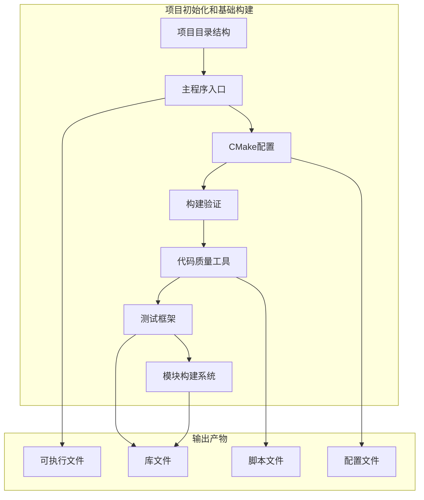

# 第一阶段：项目初始化和基础构建

> **文档版本**: v2.0  
> **最后更新**: 2026-04-09  
> **责任人**: IDCU Team  
> **任务状态**: ⏳ 待开始

---

## 1. 任务边界

### 1.1 核心目标
完成项目初始化和基础构建，创建可运行的 Hello World 程序，配置 CMake 构建系统，添加代码质量工具，搭建测试框架，初始化 idcu-module-build 模块构建系统。

### 1.2 不做什么
- 不实现具体业务功能
- 不创建核心库
- 不开发业务模块
- 不进行性能优化

### 1.3 输入
- 项目需求文档
- 技术架构设计
- 开发环境配置

### 1.4 输出
- 可运行的 Hello World 程序
- 配置好的 CMake 构建系统
- 代码质量工具配置
- 测试框架
- idcu-module-build 模块构建系统

### 1.5 前置依赖
- 开发环境已搭建（GCC/MSVC、CMake、Git）
- 项目仓库已创建

---

## 2. 技术实现方案

### 2.1 核心选型
- **编译工具**: GCC 9.0+ / MSVC 2019+
- **构建系统**: CMake 3.15+
- **代码质量工具**: clang-format, clang-tidy
- **测试框架**: 自定义测试框架
- **模块构建**: idcu-module-build

### 2.2 核心逻辑
```
1. 创建项目目录结构
2. 编写主程序入口
3. 配置 CMake 构建系统
4. 验证项目可以编译
5. 添加代码质量工具
6. 搭建测试框架
7. 初始化 idcu-module-build
```

### 2.3 数据结构/接口
- 项目目录结构
- CMake 配置文件
- 测试框架接口
- idcu-module-build 配置

### 2.4 跨平台适配
- Windows/Linux 路径分隔符差异
- 编译命令差异
- 脚本文件差异（.bat/.sh）

---

## 3. 验收标准（可量化）

### 3.1 功能验收
- [ ] 项目目录结构完整
- [ ] 主程序可以编译和运行
- [ ] CMake 配置支持 Debug 和 Release 构建
- [ ] 代码质量工具可以正常使用
- [ ] 测试框架可以运行示例测试
- [ ] idcu-module-build 可以创建新模块

### 3.2 性能验收
- 项目构建时间 ≤ 10 秒（Debug 模式）
- 主程序启动时间 ≤ 100ms
- 测试框架运行时间 ≤ 1 秒

### 3.3 异常验收
- [ ] 构建失败时有明确错误信息
- [ ] 测试失败时有详细日志
- [ ] 代码质量检查失败时有具体提示

---

## 4. 执行计划

### 4.1 工期
2-3 天

### 4.2 里程碑
- D1: 完成项目初始化和目录结构创建
- D1: 完成主程序入口和 CMake 配置
- D2: 完成代码质量工具和测试框架
- D2: 完成 idcu-module-build 初始化
- D3: 验证所有功能并进行优化

### 4.3 人力
1 人（技能要求：C语言、CMake、Git）

---

## 5. 工程化要求

### 5.1 编码规范
- 对齐 .clang-format 规范
- 函数名小写+下划线
- 结构体前缀 idcu_
- 缩进 4 空格

### 5.2 测试要求
- 测试框架覆盖基础功能
- 示例测试通过
- 测试覆盖率 ≥ 60%

### 5.3 部署指引
- 编译命令：cmake --build build
- 运行命令：./build/bin/idcu_agent
- 测试命令：./build/libs/idcu-testframework/example_simple_test

---

## 6. 风险与应对

### 6.1 风险1
描述：跨平台编译差异  
应对：使用条件编译，分别测试 Windows 和 Linux 平台

### 6.2 风险2
描述：CMake 配置复杂  
应对：参考模板配置，逐步调试，确保基本功能可用

---

## 7. 详细实现步骤

### 7.1 任务列表

| 序号 | 任务 | 状态 | 预计时间 | 依赖 |
|-----|------|------|---------|------|
| 1.1 | [创建项目目录结构](./01_create_project_structure.md) | ⏳ 待开始 | 30分钟 | 无 |
| 1.2 | [编写主程序入口](./02_write_main_entry.md) | ⏳ 待开始 | 1小时 | 1.1 |
| 1.3 | [配置 CMake 构建系统](./03_configure_cmake.md) | ⏳ 待开始 | 1.5小时 | 1.2 |
| 1.4 | [验证项目可以编译](./04_verify_build.md) | ⏳ 待开始 | 1小时 | 1.3 |
| 1.5 | [添加代码质量工具](./05_add_code_quality_tools.md) | ⏳ 待开始 | 1小时 | 1.4 |
| 1.6 | [搭建测试框架](./06_setup_test_framework.md) | ⏳ 待开始 | 2小时 | 1.5 |
| 1.7 | [初始化 idcu-module-build](./07_init_module_build.md) | ⏳ 待开始 | 2小时 | 1.6 |

### 7.2 阶段架构图



### 7.3 阶段完成演示

运行以下命令展示成果：

```bash
# 1. 清理并重新构建
rm -rf build
cmake -B build -DCMAKE_BUILD_TYPE=Debug -DBUILD_TESTS=ON -DBUILD_EXAMPLES=ON
cmake --build build -j4

# 2. 运行主程序
echo "=== Running main program ==="
./build/bin/idcu_agent --version
./build/bin/idcu_agent --help

# 3. 运行测试框架示例
echo ""
echo "=== Running test framework example ==="
./build/libs/idcu-testframework/example_simple_test

# 4. 检查代码格式
echo ""
echo "=== Checking code format ==="
scripts/windows/check_format.bat  # 或 scripts/linux/check_format.sh

echo ""
echo "======================================="
echo "Phase 1 is COMPLETE! 🎉"
echo "======================================="
```

---

## 8. 验证检查清单

在进入阶段 2 之前，请确认：

- [ ] **1.1 - 创建项目结构**
  - [ ] 所有目录已创建
  - [ ] .gitignore 已配置
  - [ ] README.md 已创建
  - [ ] 已提交 Git

- [ ] **1.2 - 编写主程序入口**
  - [ ] main.c 已创建
  - [ ] 支持命令行参数（--help, --version）
  - [ ] 代码已格式化
  - [ ] 已提交 Git

- [ ] **1.3 - 创建 CMake 构建配置**
  - [ ] 根 CMakeLists.txt 已创建
  - [ ] 支持 Debug 和 Release 构建
  - [ ] 有 BUILD_TESTS 和 BUILD_EXAMPLES 选项
  - [ ] 有配置摘要输出
  - [ ] 已提交 Git

- [ ] **1.4 - 验证项目可以编译**
  - [ ] Debug 版本编译成功
  - [ ] Release 版本编译成功
  - [ ] 程序可以正常运行
  - [ ] 命令行参数工作正常
  - [ ] 在至少一个平台上验证过

- [ ] **1.5 - 添加代码质量工具**
  - [ ] .clang-format 已创建
  - [ ] .clang-tidy 已创建
  - [ ] format 脚本已创建
  - [ ] check-format 脚本已创建
  - [ ] 现有代码已格式化
  - [ ] 已提交 Git

- [ ] **1.6 - 搭建测试框架**
  - [ ] 测试框架已创建
  - [ ] 有断言宏
  - [ ] 有测试注册机制
  - [ ] 有示例测试
  - [ ] 示例测试可以运行并通过
  - [ ] 已提交 Git

- [ ] **1.7 - 初始化 idcu-module-build**
  - [ ] 目录结构已创建
  - [ ] 核心 CMake 模块已创建
  - [ ] 有 README 文档
  - [ ] 已提交 Git

---

## 9. Git 提交

### 9.1 阶段完成提交
```bash
git add .
git commit -m "feat(phase1): complete project initialization and basic build

- Create project directory structure
- Write main program entry
- Configure CMake build system
- Verify project can compile
- Add code quality tools
- Set up test framework
- Initialize idcu-module-build"

# 可选：标记阶段完成
git tag -a v0.1.0-phase1 -m "Complete Phase 1: Project initialization and basic build"
git push origin v0.1.0-phase1
```

---

## 10. 常见问题排查

| 问题 | 可能原因 | 解决方案 |
|-----|---------|---------|
| CMake 配置失败 | 路径错误或依赖缺失 | 检查 CMakeLists.txt 配置，确保依赖正确 |
| 编译失败 | 代码语法错误或头文件缺失 | 检查编译器错误信息，修复代码问题 |
| 测试框架运行失败 | 测试代码错误或环境问题 | 检查测试代码，确保测试环境正确 |
| 代码质量检查失败 | 代码格式不符合规范 | 运行 format 脚本自动格式化代码 |

---

**恭喜！你已完成阶段 1！现在可以进入阶段 2 了！** 🚀