# 任务 3.0: 阶段 3 总览 - 独立库开发与完善

&gt; **文档版本**: v2.0  
&gt; **最后更新**: 2026-04-08  
&gt; **责任人**: IDCU Team  
&gt; **任务状态**: ⏳ 待开始

---

## 1. 任务边界

### 1.1 核心目标
完成本阶段后，应构建 30 个独立的、可复用的功能库，包括：日志系统、JSON/YAML 解析、配置管理、网络通信、监控告警、安全隔离等基础能力。所有库应独立可测试，无项目特定依赖。

### 1.2 不做什么
- 不实现项目特定的业务逻辑
- 不创建依赖微内核的库（库应独立可使用）
- 不做跨阶段的集成工作（仅完成独立库）

### 1.3 输入
- 阶段 2 完成的 idcu-common 基础库
- 参考代码：现有 libs/ 目录下的实现

### 1.4 输出
- 30 个完整的独立库（libs/ 目录下）
- 每个库包含：头文件、源文件、CMakeLists.txt、README.md、单元测试
- 所有库可独立编译和测试

### 1.5 前置依赖
- phase2 已完成，idcu-common 可用
- 构建系统已配置（CMake）

---

## 2. 技术实现方案

### 2.1 核心选型
- **架构模式**: 单一职责原则，每个库只负责一个功能领域
- **构建系统**: CMake + idcu-module-build
- **配置格式**: 优先使用 YAML，兼容 JSON
- **测试框架**: 内部轻量级测试框架

### 2.2 核心逻辑
```
1. 按依赖顺序开发库（基础层 → 配置层 → 网络层 → 监控层 → 安全层 → 高级层）
2. 每个库遵循标准开发流程：TDD → 实现 → 文档 → 测试
3. 所有库统一使用 CMake 构建配置
4. 每个库都有独立的单元测试覆盖率 ≥ 80%
```

### 2.3 数据结构/接口
每个库的标准结构：
```
libs/idcu-xxx/
├── include/idcu/xxx/   # 头文件
├── src/idcu/xxx/       # 源文件
├── tests/               # 单元测试
├── examples/            # 示例代码（可选）
├── CMakeLists.txt       # 构建配置
├── README.md            # 文档
└── module.json          # 元数据
```

### 2.4 跨平台适配
- 所有库同时支持 Windows 和 Linux
- 使用 idcu-common 中的跨平台抽象
- 文件路径使用正斜杠，CMake 自动处理

---

## 3. 验收标准（可量化）

### 3.1 功能验收
- [ ] 所有 30 个库都已创建完成
- [ ] 每个库都能独立编译通过
- [ ] 每个库的单元测试通过率 100%
- [ ] 每个库都有完整的 README 文档
- [ ] 库之间依赖关系正确，无循环依赖

### 3.2 性能验收
- 单个库编译时间 ≤ 30 秒
- 单元测试执行时间 ≤ 2 分钟/库
- 内存占用：基础库 ≤ 1MB，高级库 ≤ 5MB

### 3.3 异常验收
- [ ] 库初始化失败时有明确的错误码和日志
- [ ] 资源泄漏检测通过（Valgrind/AddressSanitizer）
- [ ] 边界条件测试通过

---

## 4. 执行计划

### 4.1 工期
10 天/人

### 4.2 里程碑
- D1-D2: 基础工具层（idcu-log、idcu-json、idcu-yaml、idcu-memory、idcu-utils）
- D3-D4: 配置与存储层（idcu-config、idcu-storage、idcu-cache）
- D5-D6: 网络与通信层（idcu-network、idcu-conn-pool、idcu-http-server、idcu-http-client、idcu-msgbus、idcu-coroutine）
- D7-D8: 监控与服务层（idcu-metrics、idcu-healthcheck、idcu-alert、idcu-watchdog、idcu-discovery）
- D9-D10: 安全与插件层 + 高级功能层（剩余 15 个库）

### 4.3 人力
2 人（技能要求：C 语言 + 跨平台开发 + 单元测试）

---

## 5. 工程化要求

### 5.1 编码规范
- 对齐项目 .clang-format 规范
- 函数名小写 + 下划线，结构体前缀 idcu_
- 所有公共 API 有详细注释

### 5.2 测试要求
- 单元测试覆盖率 ≥ 80%
- 每个库至少 5 个测试用例
- 集成测试覆盖主要使用场景

### 5.3 部署指引
- 编译命令：`cmake -B build &amp;&amp; cmake --build build`
- 安装路径：`/usr/local/lib` 或项目 build 目录

---

## 6. 风险与应对

### 6.1 风险1
描述：库之间依赖关系复杂，开发顺序难安排  
应对：制定详细的依赖关系图，按拓扑排序开发

### 6.2 风险2
描述：跨平台兼容性问题多  
应对：每个库都在 Windows 和 Linux 上同时测试，使用 CI 自动化

---

## 7. 详细实现步骤

### 阶段架构图

```mermaid
flowchart TD
    subgraph 基础工具层
        idcu_log[日志系统]
        idcu_json[JSON解析]
        idcu_yaml[YAML解析]
        idcu_memory[内存池管理]
        idcu_utils[通用工具函数]
    end

    subgraph 配置与存储层
        idcu_config[配置管理]
        idcu_storage[持久化存储]
        idcu_cache[内存缓存]
    end

    subgraph 网络与通信层
        idcu_network[网络层]
        idcu_conn_pool[连接池管理]
        idcu_http_server[HTTP服务器]
        idcu_http_client[HTTP客户端]
        idcu_msgbus[消息总线库]
        idcu_coroutine[协程库]
    end

    subgraph 监控与服务层
        idcu_metrics[指标收集]
        idcu_healthcheck[健康检查]
        idcu_alert[告警管理]
        idcu_watchdog[看门狗]
        idcu_discovery[节点发现]
    end

    subgraph 安全与插件层
        idcu_sandbox[沙箱安全]
        idcu_permission[权限管理]
        idcu_plugin[插件系统]
        idcu_management[管理CLI]
    end

    subgraph 高级功能层
        idcu_distributed[分布式支持]
        idcu_scheduler[任务调度]
        idcu_device_collector[设备采集]
        idcu_server_monitor[服务器监控]
        idcu_module_isolation[模块隔离]
        idcu_module_verifier[模块验证]
    end

    subgraph 依赖关系
        idcu_common[通用基础库]
    end

    idcu_common --> idcu_log
    idcu_common --> idcu_json
    idcu_common --> idcu_yaml
    idcu_common --> idcu_memory
    idcu_common --> idcu_utils

    idcu_log --> idcu_config
    idcu_json --> idcu_config
    idcu_yaml --> idcu_config
    idcu_memory --> idcu_storage
    idcu_memory --> idcu_cache

    idcu_utils --> idcu_network
    idcu_memory --> idcu_network
    idcu_network --> idcu_conn_pool
    idcu_network --> idcu_http_server
    idcu_network --> idcu_http_client
    idcu_common --> idcu_msgbus
    idcu_common --> idcu_coroutine

    idcu_log --> idcu_metrics
    idcu_log --> idcu_healthcheck
    idcu_log --> idcu_alert
    idcu_utils --> idcu_watchdog
    idcu_network --> idcu_discovery

    idcu_common --> idcu_sandbox
    idcu_common --> idcu_permission
    idcu_common --> idcu_plugin
    idcu_utils --> idcu_management

    idcu_network --> idcu_distributed
    idcu_coroutine --> idcu_scheduler
    idcu_network --> idcu_device_collector
    idcu_metrics --> idcu_server_monitor
    idcu_common --> idcu_module_isolation
    idcu_common --> idcu_module_verifier
```



### 库的分类与开发顺序

#### 基础工具层（5 个库）
1. **idcu-log** - 日志系统（多级别、文件输出）
2. **idcu-json** - JSON 解析与序列化
3. **idcu-yaml** - YAML 解析与序列化
4. **idcu-memory** - 内存池管理
5. **idcu-utils** - 通用工具函数

#### 配置与存储层（3 个库）
6. **idcu-config** - 配置管理（热重载、多环境）
7. **idcu-storage** - 持久化存储接口
8. **idcu-cache** - 内存缓存

#### 网络与通信层（6 个库）
9. **idcu-network** - 网络层（TCP/UDP、Socket 封装）
10. **idcu-conn-pool** - 连接池管理
11. **idcu-http-server** - HTTP 服务器
12. **idcu-http-client** - HTTP 客户端
13. **idcu-msgbus** - 独立消息总线库
14. **idcu-coroutine** - 独立协程库

#### 监控与服务层（5 个库）
15. **idcu-metrics** - 指标收集（Counter、Gauge、Histogram）
16. **idcu-healthcheck** - 健康检查
17. **idcu-alert** - 告警管理（规则、通知）
18. **idcu-watchdog** - 看门狗定时器
19. **idcu-discovery** - 节点发现

#### 安全与插件层（4 个库）
20. **idcu-sandbox** - 沙箱安全隔离
21. **idcu-permission** - 权限管理
22. **idcu-plugin** - 插件加载系统
23. **idcu-management** - 管理 CLI 和 API

#### 高级功能层（7 个库）
24. **idcu-distributed** - 分布式节点支持
25. **idcu-scheduler** - 任务调度器
26. **idcu-device-collector** - 设备数据采集
27. **idcu-server-monitor** - 服务器监控
28. **idcu-module-isolation** - 模块隔离
29. **idcu-module-verifier** - 模块验证

---

## 8. 验证检查清单

- [ ] 所有 30 个库目录已创建
- [ ] 每个库都有 CMakeLists.txt
- [ ] 每个库都有 README.md
- [ ] 每个库都有单元测试
- [ ] 所有库可独立编译
- [ ] 所有单元测试通过
- [ ] 跨平台验证通过（Windows + Linux）
- [ ] 已提交 Git

---

## 9. Git 提交

```bash
# 按批次提交
git add libs/idcu-log/ libs/idcu-json/ libs/idcu-yaml/
git commit -m "feat(phase3): add基础工具层库

- Add idcu-log library
- Add idcu-json library
- Add idcu-yaml library
- Add unit tests for all"

# 后续批次类似...
```

---

## 10. 常见问题排查

| 问题 | 可能原因 | 解决方案 |
|-----|---------|---------|
| 库依赖编译失败 | 依赖库未正确链接 | 检查 CMakeLists.txt 中的 target_link_libraries |
| 跨平台编译错误 | 使用了平台特定 API | 使用 idcu-common 中的跨平台抽象 |
| 单元测试覆盖率低 | 测试用例不足 | 补充边界条件和异常场景测试 |
