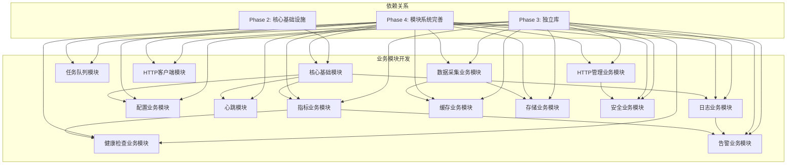

# 任务 5.0: 第五阶段 - 业务模块开发

> **文档版本**: v2.0  
> **最后更新**: 2026-04-08  
> **责任人**: IDCU Team  
> **任务状态**: ⏳ 待开始

---

## 1. 任务边界

### 1.1 核心目标
完成 IDCU Agent 业务模块开发阶段，实现 13 个核心业务模块，包括：
- 模块之间通过消息总线协同工作
- 系统可以稳定运行并提供完整业务功能
- 支持业务模块的完整集成测试

### 1.2 不做什么
- 不实现生产环境的完整部署流程
- 不实现跨平台的完整性能优化
- 不实现复杂的负载均衡功能

### 1.3 输入
- phase1-4 已完成的核心基础设施
- SDK 模块开发框架
- 文档模板

### 1.4 输出
- 13 个完整的业务模块实现
- 模块间协同工作的集成测试
- 完整的模块文档

### 1.5 前置依赖
- ✅ phase1 完成：项目基础结构
- ✅ phase2 完成：核心基础设施
- ✅ phase3 完成：核心库开发
- ✅ phase4 完成：SDK 集成

---

## 2. 技术实现方案

### 2.1 核心选型
- 模块框架：IDCU SDK
- 通信机制：消息总线 (idcu-msgbus)
- 构建系统：CMake
- 配置格式：YAML

### 2.2 核心逻辑
```
1. 基于 SDK 模块框架开发业务模块
2. 模块通过消息总线进行通信
3. 每个模块遵循统一的模块结构
4. 实现完整的业务功能
5. 进行集成测试验证
```

### 2.3 数据结构/接口
- 模块标准接口：`IDCU_SDK_MODULE_DEFINE`
- 消息总线接口：`idcu_msgbus_*`
- 模块生命周期：init/start/run/stop/destroy

### 2.4 跨平台适配
- Windows/Linux 通用 SDK 接口
- 模块代码使用标准 C 语言
- CMake 跨平台构建配置

---

## 3. 验收标准（可量化）

### 3.1 功能验收
- [ ] 所有 13 个业务模块都已创建
- [ ] 每个模块可以正常初始化和启动
- [ ] 模块之间可以通过消息总线通信
- [ ] 系统可以稳定运行 24 小时无崩溃

### 3.2 性能验收
- [ ] 单个模块启动时间 ≤ 500ms
- [ ] 消息总线延迟 ≤ 10ms
- [ ] 模块间通信 QPS ≥ 1000
- [ ] 系统内存占用 ≤ 256MB

### 3.3 异常验收
- [ ] 单个模块崩溃不影响其他模块
- [ ] 模块可以正常重启恢复
- [ ] 异常情况有完整的日志记录
- [ ] 系统可以优雅关闭

---

## 4. 执行计划

### 4.1 工期
10 人天

### 4.2 里程碑
- D1-D2：完成 01-06 核心业务模块
- D3-D5：完成 07-10 数据相关模块
- D6-D8：完成 11-13 管理和安全模块
- D9-D10：集成测试和验证

### 4.3 人力
2 人（技能要求：C语言 + 模块化开发 + 系统架构）

---

## 5. 工程化要求

### 5.1 编码规范
- 对齐 .clang-format 规范
- 函数名小写+下划线
- 结构体前缀 idcu_

### 5.2 测试要求
- 单元测试覆盖率 ≥ 70%
- 集成测试覆盖所有模块间交互场景
- 每个模块有完整的验证检查清单

### 5.3 部署指引
- 编译命令：cmake --build build
- 模块路径：modules/business/
- 配置文件：config/default/

---

## 6. 风险与应对

### 6.1 风险1
描述：模块间接口定义不一致导致集成困难  
应对：预先定义统一的模块接口规范，定期进行接口评审

### 6.2 风险2
描述：消息总线性能不满足需求  
应对：提前进行性能测试，预留优化时间，准备备选方案

---

## 7. 详细实现步骤

### 阶段架构图



### 业务模块任务列表

| 序号 | 业务模块 | 状态 | 预计时间 | 依赖 | 功能 |
|-----|---------|------|---------|------|------|
| 5.1 | [core-module](./01_core_module.md) | ⏳ 待开始 | 4小时 | SDK + 基础集成 | 核心基础模块 |
| 5.2 | [log-module](./02_log_module.md) | ⏳ 待开始 | 3小时 | SDK + 3.1 | 日志业务模块 |
| 5.3 | [config-module](./03_config_module.md) | ⏳ 待开始 | 3小时 | SDK + 3.6 | 配置业务模块 |
| 5.4 | [heartbeat](./04_heartbeat.md) | ⏳ 待开始 | 2小时 | SDK | 心跳模块 |
| 5.5 | [metrics-module](./05_metrics_module.md) | ⏳ 待开始 | 3小时 | SDK + 3.15 | 指标业务模块 |
| 5.6 | [task-queue](./05_task_queue.md) | ⏳ 待开始 | 3小时 | SDK + 3.25 | 任务队列模块 |
| 5.7 | [healthcheck-module](./06_healthcheck_module.md) | ⏳ 待开始 | 3小时 | SDK + 3.16 | 健康检查业务模块 |
| 5.8 | [alert-module](./07_alert_module.md) | ⏳ 待开始 | 3小时 | SDK + 3.17 | 告警业务模块 |
| 5.9 | [collect-module](./08_collect_module.md) | ⏳ 待开始 | 3小时 | SDK + 3.26 | 数据采集业务模块 |
| 5.10 | [cache-module](./09_cache_module.md) | ⏳ 待开始 | 2小时 | SDK + 3.8 | 缓存业务模块 |
| 5.11 | [storage-module](./10_storage_module.md) | ⏳ 待开始 | 2小时 | SDK + 3.7 | 存储业务模块 |
| 5.12 | [security-module](./11_security_module.md) | ⏳ 待开始 | 3小时 | SDK + 3.20 + 3.21 | 安全业务模块 |
| 5.13 | [http-client-module](./12_http_client_module.md) | ⏳ 待开始 | 3小时 | SDK + 3.12 | HTTP 客户端业务模块 |
| 5.14 | [http-management](./13_http_management_module.md) | ⏳ 待开始 | 4小时 | SDK + 3.23 | HTTP 管理业务模块 |

### 每个业务模块的标准结构
第五阶段的每个业务模块都应该包含：
- 详细的业务逻辑
- 与其他模块的交互
- 消息总线通信
- 完整的集成测试

### 创建业务模块示例
让我们创建一个简单的心跳模块作为示例。

#### 创建目录结构
```bash
mkdir -p modules/business/heartbeat/src
```

#### 编写模块代码
创建 `modules/business/heartbeat/src/heartbeat_module.c`：
```c
#include "sdk.h"
#include <stdio.h>
#include <stdlib.h>
#include <string.h>

typedef struct {
    int counter;
} HeartbeatData;

static int heartbeat_init(idcu_SdkContext* ctx) {
    idcu_sdk_log_info(ctx, "Initializing heartbeat module");
    
    HeartbeatData* data = malloc(sizeof(HeartbeatData));
    if (!data) {
        return IDCU_ERR_NO_MEMORY;
    }
    data->counter = 0;
    idcu_sdk_set_user_data(ctx, data);
    
    return IDCU_ERR_SUCCESS;
}

static int heartbeat_start(idcu_SdkContext* ctx) {
    idcu_sdk_log_info(ctx, "Starting heartbeat module");
    return IDCU_ERR_SUCCESS;
}

static int heartbeat_run(idcu_SdkContext* ctx) {
    HeartbeatData* data = idcu_sdk_get_user_data(ctx);
    
    if (data->counter % 1000000 == 0) {
        idcu_sdk_log_info(ctx, "Heartbeat #%d", data->counter / 1000000);
    }
    data->counter++;
    
    return IDCU_ERR_SUCCESS;
}

static int heartbeat_stop(idcu_SdkContext* ctx) {
    idcu_sdk_log_info(ctx, "Stopping heartbeat module");
    return IDCU_ERR_SUCCESS;
}

static void heartbeat_destroy(idcu_SdkContext* ctx) {
    HeartbeatData* data = idcu_sdk_get_user_data(ctx);
    if (data) {
        free(data);
    }
    idcu_sdk_log_info(ctx, "Destroying heartbeat module");
}

IDCU_SDK_MODULE_DEFINE(
    heartbeat,
    "1.0.0",
    "Heartbeat module",
    heartbeat_init,
    heartbeat_start,
    heartbeat_run,
    heartbeat_stop,
    heartbeat_destroy
);
```

#### 创建 CMakeLists.txt
```cmake
add_library(idcu_business_heartbeat STATIC
    src/heartbeat_module.c
)

target_include_directories(idcu_business_heartbeat PUBLIC
    ${CMAKE_CURRENT_SOURCE_DIR}/include
    ${CMAKE_SOURCE_DIR}/modules/core/sdk/include
)

target_link_libraries(idcu_business_heartbeat PRIVATE
    idcu::common
    idcu::log
    idcu_core_sdk
)
```

---

## 8. 验证检查清单

- [ ] 所有 13 个业务模块都已创建
- [ ] 每个模块都有完整的 CMakeLists.txt
- [ ] 每个模块都有 module.yaml 配置
- [ ] 每个模块都有 README.md
- [ ] 模块可以正常编译
- [ ] 模块可以正常初始化和启动
- [ ] 模块之间可以通过消息总线通信
- [ ] 系统可以稳定运行
- [ ] 所有集成测试通过

---

## 9. Git 提交

```bash
git add docs/tasks/phase5/
git commit -m "feat: complete phase5 business module development

- Add core-module business module
- Add log-module business module
- Add config-module business module
- Add heartbeat module
- Add metrics-module business module
- Add task-queue module
- Add healthcheck-module business module
- Add alert-module business module
- Add collect-module business module
- Add cache-module business module
- Add storage-module business module
- Add security-module business module
- Add http-client-module business module
- Add http-management business module
- Add phase5 overview document"
```

---

## 10. 常见问题排查

| 问题 | 可能原因 | 解决方案 |
|-----|---------|---------|
| 模块编译失败 | 依赖库未正确链接 | 检查 CMakeLists.txt 中的依赖配置 |
| 模块间通信失败 | 消息总线未正确初始化 | 确保消息总线在模块启动前已初始化 |
| 系统不稳定 | 模块生命周期管理问题 | 检查模块的 init/start/stop/destroy 实现 |
