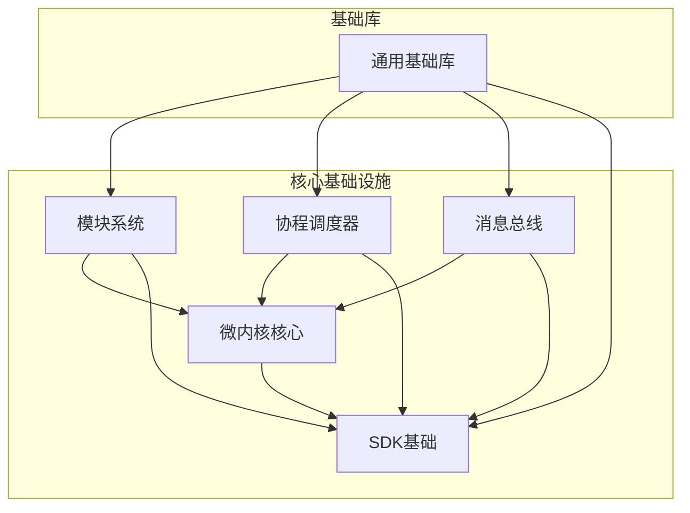
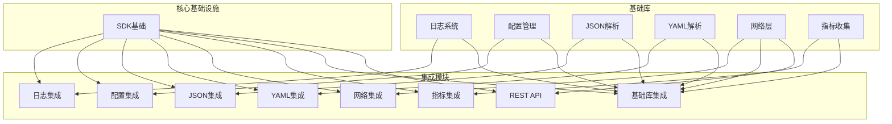

# 模块依赖关系图

> **文档版本**: v1.0  
> **最后更新**: 2026-04-08  
> **责任人**: IDCU Team  
> **任务状态**: ✅ 已完成

---

## 1. 依赖关系概览

IDCU Agent 项目采用模块化架构，各模块之间存在明确的依赖关系。了解这些依赖关系对于项目的开发、测试和维护至关重要。本文档提供了详细的模块依赖关系图，帮助开发者理解模块间的依赖关系，避免循环依赖，确保项目的可维护性和可扩展性。

## 2. 核心模块依赖关系

### 2.1 核心基础设施依赖关系

### 2.2 基础库依赖关系

```mermaid
graph TD
    subgraph 基础工具层
        idcu_log[日志系统]
        idcu_json[JSON解析]
        idcu_yaml[YAML解析]
        idcu_memory[内存池管理]
        idcu_utils[通用工具函数]
    end

    subgraph 配置与存储层
        idcu_config[配置管理]
        idcu_storage[持久化存储]
        idcu_cache[内存缓存]
    end

    subgraph 网络与通信层
        idcu_network[网络层]
        idcu_conn_pool[连接池管理]
        idcu_http_server[HTTP服务器]
        idcu_http_client[HTTP客户端]
        idcu_msgbus[消息总线库]
        idcu_coroutine[协程库]
    end

    subgraph 监控与服务层
        idcu_metrics[指标收集]
        idcu_healthcheck[健康检查]
        idcu_alert[告警管理]
        idcu_watchdog[看门狗]
        idcu_discovery[节点发现]
    end

    subgraph 安全与插件层
        idcu_sandbox[沙箱安全]
        idcu_permission[权限管理]
        idcu_plugin[插件系统]
        idcu_management[管理CLI]
    end

    subgraph 高级功能层
        idcu_distributed[分布式支持]
        idcu_scheduler[任务调度]
        idcu_device_collector[设备采集]
        idcu_server_monitor[服务器监控]
        idcu_module_isolation[模块隔离]
        idcu_module_verifier[模块验证]
    end

    subgraph 基础依赖
        idcu_common[通用基础库]
    end

    idcu_common --> idcu_log
    idcu_common --> idcu_json
    idcu_common --> idcu_yaml
    idcu_common --> idcu_memory
    idcu_common --> idcu_utils
    idcu_common --> idcu_network
    idcu_common --> idcu_msgbus
    idcu_common --> idcu_coroutine
    idcu_common --> idcu_sandbox
    idcu_common --> idcu_permission
    idcu_common --> idcu_plugin
    idcu_common --> idcu_module_isolation
    idcu_common --> idcu_module_verifier

    idcu_log --> idcu_config
    idcu_log --> idcu_metrics
    idcu_log --> idcu_healthcheck
    idcu_log --> idcu_alert
    idcu_json --> idcu_config
    idcu_yaml --> idcu_config
    idcu_memory --> idcu_storage
    idcu_memory --> idcu_cache
    idcu_memory --> idcu_network
    idcu_utils --> idcu_network
    idcu_utils --> idcu_watchdog
    idcu_utils --> idcu_management

    idcu_network --> idcu_conn_pool
    idcu_network --> idcu_http_server
    idcu_network --> idcu_http_client
    idcu_network --> idcu_discovery
    idcu_network --> idcu_distributed
    idcu_network --> idcu_device_collector

    idcu_metrics --> idcu_server_monitor
    idcu_coroutine --> idcu_scheduler
```

### 2.3 集成模块依赖关系

### 2.4 业务模块依赖关系

```mermaid
graph TD
    subgraph 业务模块
        core_module[核心基础模块]
        log_module[日志业务模块]
        config_module[配置业务模块]
        heartbeat[心跳模块]
        metrics_module[指标业务模块]
        task_queue[任务队列模块]
        healthcheck_module[健康检查业务模块]
        alert_module[告警业务模块]
        collect_module[数据采集业务模块]
        cache_module[缓存业务模块]
        storage_module[存储业务模块]
        security_module[安全业务模块]
        http_client_module[HTTP客户端模块]
        http_management_module[HTTP管理业务模块]
    end

    subgraph 集成模块
        log_integration[日志集成]
        config_integration[配置集成]
        network_integration[网络集成]
        metrics_integration[指标集成]
    end

    subgraph 基础库
        idcu_healthcheck[健康检查]
        idcu_alert[告警管理]
        idcu_cache[内存缓存]
        idcu_storage[持久化存储]
        idcu_http_client[HTTP客户端]
        idcu_http_server[HTTP服务器]
    end

    subgraph 核心基础设施
        message_bus[消息总线]
        coroutine_scheduler[协程调度器]
        sdk_base[SDK基础]
    end

    log_integration --> core_module
    config_integration --> core_module
    log_integration --> log_module
    config_integration --> config_module
    message_bus --> heartbeat
    metrics_integration --> metrics_module
    coroutine_scheduler --> task_queue
    idcu_healthcheck --> healthcheck_module
    idcu_alert --> alert_module
    network_integration --> collect_module
    idcu_cache --> cache_module
    idcu_storage --> storage_module
    idcu_http_client --> http_client_module
    idcu_http_server --> http_management_module

    sdk_base --> core_module
    sdk_base --> log_module
    sdk_base --> config_module
    sdk_base --> heartbeat
    sdk_base --> metrics_module
    sdk_base --> task_queue
    sdk_base --> healthcheck_module
    sdk_base --> alert_module
    sdk_base --> collect_module
    sdk_base --> cache_module
    sdk_base --> storage_module
    sdk_base --> security_module
    sdk_base --> http_client_module
    sdk_base --> http_management_module

    core_module --> log_module
    core_module --> config_module
    core_module --> heartbeat
    core_module --> metrics_module
    log_module --> alert_module
    metrics_module --> healthcheck_module
    metrics_module --> alert_module
    collect_module --> storage_module
    collect_module --> cache_module
    http_management_module --> security_module
```

## 3. 依赖关系分析

### 3.1 依赖层次

IDCU Agent 项目的依赖关系可以分为以下几个层次：

1. **基础层**：包含 idcu-common 通用基础库，是所有其他模块的基础
2. **核心层**：包含微内核、模块系统、协程调度器和消息总线，构建在基础层之上
3. **基础库层**：包含各种功能库，如日志、配置、网络等，构建在基础层之上
4. **集成层**：将基础库封装为模块系统可用的接口，构建在基础库层和核心层之上
5. **业务模块层**：实现具体的业务功能，构建在集成层和核心层之上

### 3.2 关键依赖路径

#### 基础库依赖路径
- **idcu-common → idcu-log → idcu-config**
- **idcu-common → idcu-memory → idcu-storage**
- **idcu-common → idcu-utils → idcu-network → idcu-http-server**

#### 业务模块依赖路径
- **sdk-base → core-module → log-module**
- **sdk-base → core-module → config-module**
- **sdk-base → metrics-module → healthcheck-module**
- **sdk-base → collect-module → storage-module**

### 3.3 循环依赖检查

通过依赖关系图分析，目前项目中不存在循环依赖。所有模块的依赖关系都是单向的，从基础模块指向高层模块。

## 4. 依赖管理建议

### 4.1 依赖管理原则

1. **最小依赖原则**：每个模块只依赖必要的其他模块
2. **单向依赖原则**：依赖关系应该是单向的，避免循环依赖
3. **分层依赖原则**：高层模块依赖低层模块，低层模块不依赖高层模块
4. **明确依赖原则**：所有依赖关系都应该在 CMakeLists.txt 中明确声明

### 4.2 依赖管理工具

- **CMake**：用于管理编译时依赖
- **Git Submodules**：用于管理第三方库依赖
- **包管理器**：如 vcpkg（Windows）或 Conan（跨平台）

### 4.3 依赖版本管理

- **版本锁定**：锁定依赖库的版本，避免版本冲突
- **版本兼容**：确保依赖库的版本兼容
- **更新策略**：定期更新依赖库，修复安全漏洞和 bug

### 4.4 依赖冲突解决

1. **版本冲突**：使用版本锁定或版本兼容策略
2. **API 冲突**：使用命名空间或静态链接
3. **构建冲突**：调整构建顺序或使用不同的构建配置

## 5. 依赖关系验证

### 5.1 验证工具

- **CMake GraphViz**：生成依赖关系图
- **clang-deps**：分析 C/C++ 代码依赖
- **手动检查**：通过代码审查验证依赖关系

### 5.2 验证流程

1. **构建验证**：确保项目能够成功构建
2. **依赖图生成**：生成依赖关系图，检查是否存在循环依赖
3. **代码审查**：审查代码，确保依赖关系合理
4. **测试验证**：运行测试，确保依赖关系正确

### 5.3 常见依赖问题

| 问题 | 症状 | 解决方案 |
|-----|------|---------|
| 循环依赖 | 编译失败或运行时错误 | 重构代码，打破循环依赖 |
| 版本冲突 | 编译错误或运行时异常 | 锁定依赖版本或使用版本兼容策略 |
| 缺失依赖 | 编译失败 | 添加缺失的依赖 |
| 冗余依赖 | 构建时间长，二进制文件大 | 移除不必要的依赖 |

## 6. 依赖关系最佳实践

1. **模块化设计**：将功能划分为独立的模块，减少模块间的耦合
2. **接口设计**：定义清晰的接口，减少模块间的直接依赖
3. **依赖注入**：使用依赖注入模式，减少硬编码依赖
4. **抽象层**：引入抽象层，隔离具体实现
5. **文档化**：记录模块间的依赖关系，便于理解和维护

## 7. 总结

模块依赖关系是 IDCU Agent 项目架构的重要组成部分。通过清晰的依赖关系设计，可以提高项目的可维护性、可扩展性和可靠性。本文档提供了详细的模块依赖关系图，帮助开发者理解模块间的依赖关系，避免循环依赖，确保项目的健康发展。

在项目开发过程中，应定期审查和更新依赖关系，确保依赖关系的合理性和正确性。通过遵循依赖管理的最佳实践，可以减少依赖问题，提高开发效率，保证项目的质量。

---

**审核人**：项目负责人  
**批准日期**：2026-04-08